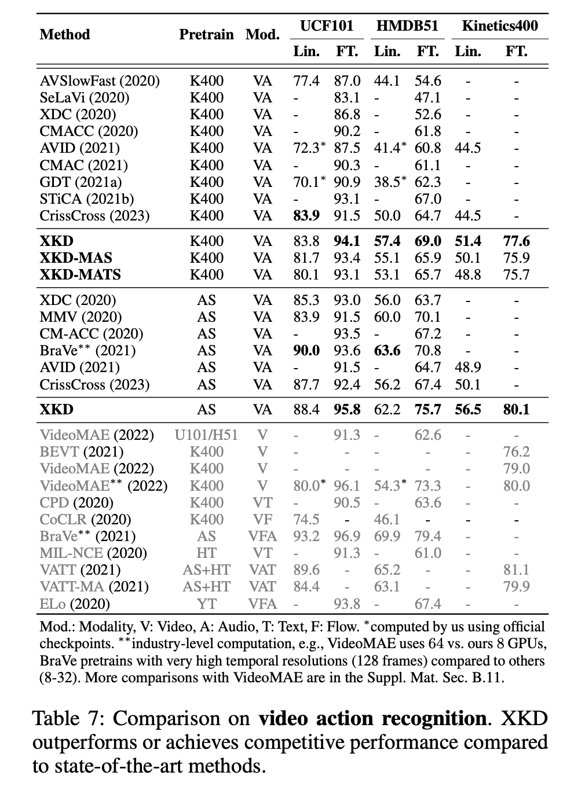

<h1 align="center"> 
XKD: Cross-modal Knowledge Distillation with Domain Alignment for Video Representation Learning
</h1>

<h3 align="center">
AAAI 2024
</h3>
<h3 align="center">
<a href="https://www.pritamsarkar.com">Pritam Sarkar</a>
&nbsp;
Ali Etemad
</h3>
<h3 align="center"> 
<a href="https://arxiv.org/pdf/2211.13929.pdf">[Paper]</a> <!-- change with pub link -->
<!-- <a href="./docs/assets/files/xkd_supp.pdf">[Appendix]</a> 
 <a href="https://arxiv.org/pdf/2211.00000.pdf"> [ArXiv]</a>   -->
 <a href="https://github.com/pritamqu/XKD/"> [Code]</a> <a href="https://pritamqu.github.io/XKD/"> [Website]</a>
</h3>


### Updates
- [x] [Paper](https://arxiv.org/abs/2211.13929)
- [x] [Pretrained model weights](https://github.com/pritamqu/XKD/releases/tag/weights)
- [x] [Evaluation codes](./codes/eval/)
- [x] [Training codes](./codes/train/)
- [x] [Supplementary material](/docs/assets/xkd_supp.pdf)


### Abstract
We present XKD, a novel self-supervised framework to learn meaningful representations from unlabelled videos. XKD is trained with two pseudo objectives. First, masked data reconstruction is performed to learn modality-specific representations from audio and visual streams. Next, self-supervised cross-modal knowledge distillation is performed between the two modalities through a teacher-student setup to learn complementary information. We introduce a novel domain alignment strategy to tackle domain discrepancy between audio and visual modalities enabling effective cross-modal knowledge distillation.
Additionally, to develop a general-purpose network capable of handling both audio and visual streams, modality-agnostic variants of XKD are introduced, which use the same pretrained backbone for different audio and visual tasks. Our proposed cross-modal knowledge distillation improves video action classification by 8% to 14% on UCF101, HMDB51, and Kinetics400. Additionally, XKD improves multimodal action classification by 5.5% on Kinetics-Sound. XKD shows state-of-the-art performance in sound classification on ESC50, achieving top-1 accuracy of 96.5%.

### Result

<table align=center>
      <center>
      <h1>
            Results
      </h1>
      </center>
      <tr><h3><mark>Ablation study</mark></h3></tr>
      <tr></tr>
      <tr><h3><mark>Effect of refinement</mark></h3></tr>
      <tr></tr>
      <tr></tr>
      <!-- <tr><h3><mark>SOTA Comparison</mark></h3></tr>
      <tr></tr>
      <tr></tr> -->
      <!-- <tr><h3><mark>Comparison with VideoMAE</mark></h3></tr>
      <tr></tr> -->
</table>


### Environment Setup

```
conda create --name xkd --file requirements.txt
```


### Datasets
The sources of all the public datasets used in this study are mentioned here.
- AudioSet: Please check this [repository](https://github.com/speedyseal/audiosetdl) to download AudioSet.
- Kinetics400: You can either use a crawler (similar to the one available for AudioSet) to download the Kinetics400, or simply download from the Amazon AWS, prepared by [CVD Foundation](https://github.com/cvdfoundation/kinetics-dataset).
- UCF101: [Website to download.](https://www.crcv.ucf.edu/data/UCF101.php)
- HMDB51: [Website to download.](https://serre-lab.clps.brown.edu/resource/hmdb-a-large-human-motion-database/)
- ESC50: [Website to download.](https://github.com/karolpiczak/ESC-50)
- FSD50K: [Website to download.](https://zenodo.org/records/4060432)
- Kinetics-Sound: This is a subset of Kinetics400


### Self-supervised Training

We provide a sample script to train XKD with Kinetics400. 

```
cd codes/train/src

# w/ modality-specific student and teachers (default)
sbatch xkd.sh 'xkd.yaml'

# w/ modality-agnostic students and modality-specific teachers encoders
sbatch xkd.sh 'xkd_mas.yaml'

# w/ modality-agnostic students and modality-agnostic teachers encoders
sbatch xkd.sh 'xkd_mats.yaml'

```


### Downstream Evaluation

The bash scripts are available here. Please make sure to update the paths in the scripts before running evaluation.
```
cd codes/eval/src/
```

### Video - Finetune

**UCF101**

```
# for eval on 3 folds
sbatch finetune_ucf101.sh config_f1
sbatch finetune_ucf101.sh config_f2
sbatch finetune_ucf101.sh config_f3
```


**HMDB51**

```
# for eval on 3 folds
sbatch finetune_hmdb51.sh config_f1
sbatch finetune_hmdb51.sh config_f2
sbatch finetune_hmdb51.sh config_f3
```

**Kinetics400**

```
sbatch finetune_k400.sh config
```

### Audio - Fintune

**FSD50K**

```
sbatch finetune_fsd50k.sh config
```

**ESC50**

```
sbatch finetune_esc50.sh config_f1
sbatch finetune_esc50.sh config_f2
sbatch finetune_esc50.sh config_f3
sbatch finetune_esc50.sh config_f4
sbatch finetune_esc50.sh config_f5
```


### Video - Linear

**UCF101**

```
# for eval on 3 folds
sbatch svm_ucf101.sh config_f1
sbatch svm_ucf101.sh config_f2
sbatch svm_ucf101.sh config_f3
```


**HMDB51**

```
# for eval on 3 folds
sbatch svm_hmdb51.sh config_f1
sbatch svm_hmdb51.sh config_f2
sbatch svm_hmdb51.sh config_f3
```

**Kinetics400**

```
sbatch linear_k400.sh config
```

### Audio - Linear

**FSD50K**

```
sbatch linear_fsd50k.sh config
```

**ESC50**

```
sbatch svm_esc50.sh config_f1
sbatch svm_esc50.sh config_f2
sbatch svm_esc50.sh config_f3
sbatch svm_esc50.sh config_f4
sbatch svm_esc50.sh config_f5
```

### Audio-visual

**Kinetics-Sound**

```
sbatch svm_ks_audvid.sh config
```


### Citation
If you find this repository useful, please consider giving a star :star: and citation using the given BibTeX entry:

```
@misc{sarkar2022xkd,
      title={XKD: Cross-modal Knowledge Distillation with Domain Alignment for Video Representation Learning}, 
      author={Pritam Sarkar and Ali Etemad},
      year={2022},
      eprint={2211.13929},
      archivePrefix={arXiv},
      primaryClass={cs.CV}
}
```

### Acknowledgments
We are grateful to **Bank of Montreal** and **Mitacs** for funding this research. We are also thankful to **SciNet HPC Consortium** for helping with the computation resources.

### Question
You may directly contact me at <pritam.sarkar@queensu.ca> or connect with me on [LinkedIn](https://www.linkedin.com/in/sarkarpritam/).
